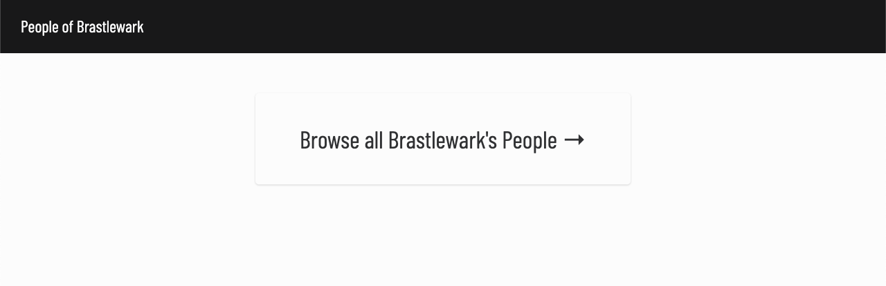
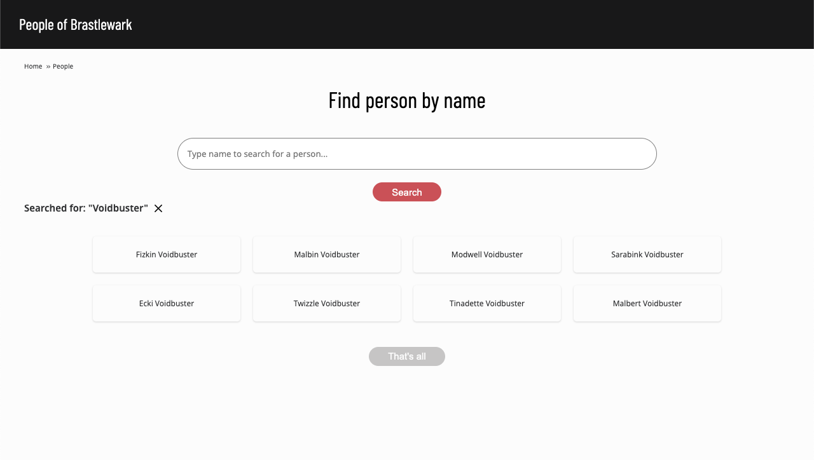
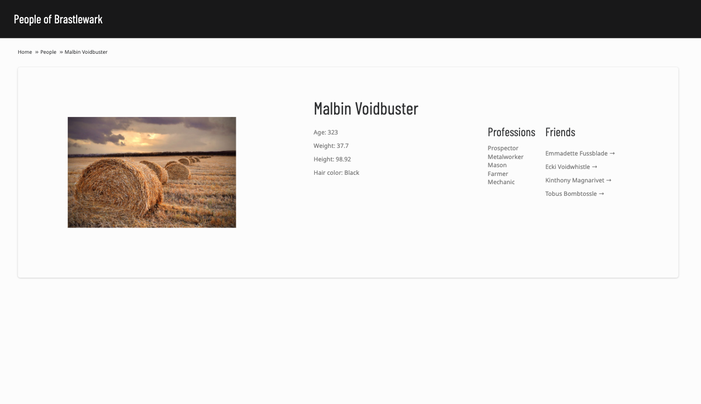
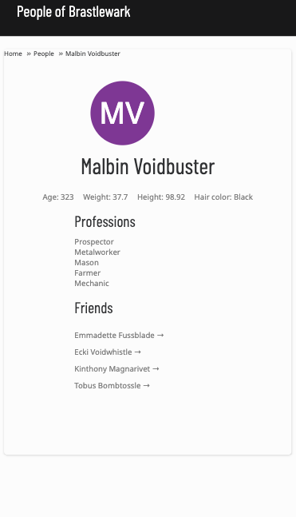

## People of Brastlewark 👲🧕 🦹‍♀️ 👩‍🌾

This app allows users to discover population of Brastlewark. User can browse through whole population or filter people by name.

It was build using React, Redux and CSS (SCSS) and bundled by [parcel-bundler](https://www.npmjs.com/package/parcel-bundler).


##### 🔥  [You can check live app here](https://brastlewark-people.netlify.app/)  🔥


### Table of contents

1. [Getting started](#🛠-Getting-started-with-dev-mode-🛠)

2. [Final product](#final-product-🌈)
3. [Things to improve](#Things-to-improve-🔨)
4. [Things not implemented](#Things-not-implemented-😿)

​	

#### 🛠 Getting started with dev mode 🛠

To start development mode follow these steps:	

1. Clone repo and navigate to root folder

```bash
git clone https://github.com/rafwit/brastlewark-people.git
cd brastlewark-people
```

2. Open project in your favourite code editor
3. Add `.env` file in root directory and fill it with following code

```text
REACT_APP_BASE_URL=<here-put-the-link-to-data-that-you-provided-me>
```

4. Install all dependencies by running below-mentioned command from project root directory

```bash
npm install
```

5. To start development server run

```bash
npm run dev
```

5. To compile edited styles from SCSS to CSS, from another terminal tab/window run

```bash
npm run compile:dev
```


#### Final product 🌈

In this part I describe main pages of the app and attach some screenshots. In addition, I add comments on decisions I've made during the development process.


**Homepage** 🏠

App starts on the homepage that allows to move to main feature - browsing people of Brastlewark. The app was designed this way to make possible scaling easier - for now there is one feature, but it maybe developed further and the homepage is already there 💃🏿


*Screenshot of homepage*




**People** 🕴🏼🕴🏼🕴🏼🕴🏼

This is the main component for now, allowing users to browse through whole population or filter by name of the person. Filtering is case insensitive. 

Filtering is expected to be most used feature, hence it is displayed on top of the page.

Page displays 50 people by default at start, however filtering is performed on whole population, as it is stored in Redux store. User can load more people by scrolling down the page and using *Load more* button. If user reaches the end, button becomes inactive (its colour changes to grey and its inner text switches to *That's all*). 

The same applies to filtered results. In addition, after applying search criteria user see what criteria was applied and can clear search by using *X* button.

The idea is that this page is very simple therefore list of people only displays full name of each person. If user is interested in checking further details, can click on person's card and is being redirected to Details page. Other reason for this approach is to avoid loading profile pictures of at least 50 all people at the very beginning.

Furthermore, user can navigate through the app using breadcrumb (both on People and Details page). It is placed in left top corner of the page.


*Screenshot of People page*




**Details page** 🔎

This page allows user to see all available information about each person. Additionally it allows to navigate to Details page of each friend. People of Brastlewark have unconventional approach ti friendship - just because you take somebody as your friend, doesn't mean that that person is taking you as the friend 🤷🏾‍♂️

On desktop view users can see the profile picture of the person, however on viewports with width less than 1024 pixels they will see avatar with the initials. On mobile views the Details page is rearranged.


*Screenshot of Details page (desktop view)*




*Screenshot of Details page (mobile view)*




#### Things to improve 🔨

- Filtering could be more flexible and for example allow to filter by profession, age range etc.

- Responsiveness could be improved - there are still some places where the app can look better on mobile devices.

- [Lighthouse performance score](https://web.dev/performance-scoring/) is just 53/100 with Total Blocking Time of 960ms - that could be improved. However, I'm not sure if this comes from Netlify hosting the app or there is something I could do.

  

#### Things not implemented 😿

I didn't add any test suit - I ran out of time. Moreover, I don't have that much experience in front-end testing to be able to quickly build reliable tests.

